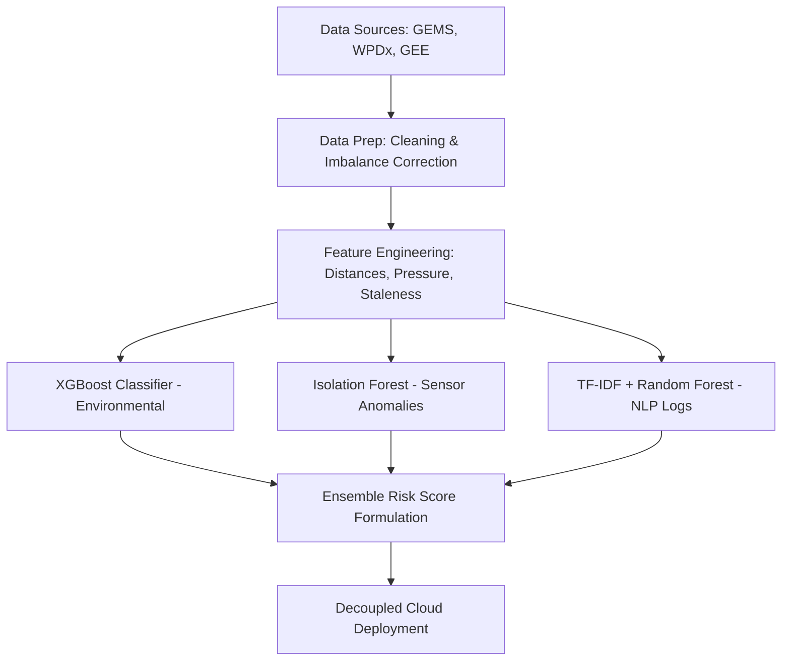

# MajiCast (formerly CleanWatAI)

MajiCast is an end-to-end, production-grade machine learning system designed to monitor and predict water quality and contamination risk in Kenya. By integrating chemical indicators, geospatial infrastructure logs, and remote sensing satellite data, MajiCast equips NGOs, local governments, and water authorities with proactive decision-making tools to prevent public health crises.

The system was refactored from a single-file Streamlit script into a high-performance decoupled architecture: the frontend is deployed to Vercel and the backend to Render.

---

## Problem Statement

Clean water access is a fundamental human right, yet over 2 billion people globally lack safely managed drinking water. In rural Kenya, traditional water quality testing is reactive, expensive, and logistically limited. This delays critical interventions when contamination occurs. The goal of this project was to build a proactive, machine learning-driven early warning system that predicts contamination risks. By leveraging environmental, geospatial, and crowd-sourced data, MajiCast reduces reliance on laboratory testing and enables NGOs and local governments to intervene before public health crises occur.

---

## Architecture and Folder Structure

```
MajiCast/
├── app/                                       # Streamlit legacy dashboard (preserved)
├── data/                                      # Data storage hierarchy
│   ├── raw/                                   # WPDx, GEMS, and GEE source datasets
│   └── processed/                             # Merged datasets (environmental.csv)
├── inference/                                 # FastAPI Inference Backend Service
│   ├── models/                                # Model pickles (.pkl)
│   ├── main.py                                # FastAPI app endpoints & CORS middleware
│   ├── render.yaml                            # Render Blueprint deployment config
│   ├── .python-version                        # Python runtime version
│   └── requirements.txt                       # Backend Python dependencies
├── notebooks/                                 # Jupyter analysis notebooks (CRISP-DM flow)
│   ├── 01_data_extraction.ipynb              # Data ingestion and raw loads
│   ├── 05_xgboost_model_training.ipynb       # XGBoost model development
│   ├── 06_nlp_model_training.ipynb           # TF-IDF & text classifier training
│   └── train_isolation_forest.ipynb          # Sensor anomaly detection
├── vercel.json                                # Frontend Vercel configuration
└── web/                                       # Next.js Web Application
    ├── public/                                # Static assets (images, markers)
    └── src/
        ├── app/                               # Next.js App Router (Home, Maps, NLP)
        │   └── api/data/route.ts              # Data query, upload, & proxy handler
        └── globals.css                        # Design system theme configuration
```

---

## Data Science and Machine Learning Flow

MajiCast aligned with the CRISP-DM (Cross-Industry Standard Process for Data Mining) methodology, transforming raw geospatial, satellite, and crowdsourced data into actionable public health risk scores.



### 1. Data Ingestion and Sources
* **Chemical Water Quality (GEMS)**: Sourced from the Global Environment Monitoring System (GEMStat). It contained physical parameters (pH, Temperature, Electrical Conductivity) and laboratory chemical measurements (Dissolved Oxygen, Nitrates, Nitrites, Ammonia).
* **Environmental and Infrastructure (WPDx)**: Infrastructure logs from the Water Point Data Exchange (22k+ records for Kenya) including water source types, technologies used, status (functional vs. non-functional), and installation years.
* **Remote Sensing (Google Earth Engine)**: Features extracted from satellite bands, matching location coordinates:
  * **Rainfall (CHIRPS)**: Sum of precipitation over the past 30 days (proxy for run-off contamination).
  * **Land Surface Temperature (MODIS LST)**: LST Day 1km 8-day average (indicative of evaporation rates).
  * **Vegetation (NDVI)**: Normalized Difference Vegetation Index (agricultural presence and run-off risk).
* **World Bank WASH Infrastructure Data**: Used for supplementary infrastructure context.
* **NGO Field Reports**: Simulated and public text reports used as training data for the NLP classifier. The synthetic nature of this data was an acknowledged limitation affecting real-world NLP prediction accuracy.

### 2. Feature Engineering and Preprocessing
* **Class Imbalance**: Synthetic Minority Over-sampling (SMOTE) and random upsampling were applied in notebooks to balance under-represented risk classes (e.g., Safe vs. Unsafe, or specific minor risk classes in textual reports).
* **Geo-distance Features**: Calculated Euclidean distances to secondary/tertiary structures, nearest major cities, and key water towers to assess accessibility and potential contaminant proximity.
* **Derived Engineering**:
  * `staleness_score`: Cumulative age and lack of maintenance calculation.
  * `crucialness`: Calculated index representing the water point's population dependency.
  * `pressure`: Physical stress index based on local population and output capacity.

---

## Machine Learning Models

MajiCast trained and served three distinct machine learning models designed to address data sparsity in rural water monitoring.

### 1. Environmental Classifier (XGBoost)
* **Objective**: Predicted water point contamination risk tier (`0: Safe Quality`, `1: Low Risk`, `2: Medium Risk`, `3: High Risk`) based on 23 geospatial and environmental features.
* **Algorithm**: Tuned Extreme Gradient Boosting (XGBoost) model combined with a `ColumnTransformer` (StandardScaler for numerical features, OneHotEncoder for categorical features).
* **Hyperparameters**:
  ```python
  {'model__subsample': 0.8, 'model__n_estimators': 100, 'model__max_depth': 10, 'model__learning_rate': 0.1, 'model__gamma': 0}
  ```
* **Performance Metrics**:
  * **Accuracy**: **81.03%**
  * **Weighted F1-Score**: **80.72%**
  * **Recall**: **81.03%**
* **Confusion Matrix Analysis**: Demonstrated solid performance on majority classes, with minor overlap between adjacent risk levels (e.g., Class 2 vs Class 3).

### 2. NLP Text Classifier (Random Forest / Logistic Regression)
* **Objective**: Classified citizen water quality descriptions as "Safe" or "Unsafe".
* **Text Preprocessing**: Lowercasing, negations handling (e.g., converting "not clean" to "no_clean" to preserve meaning), punctuation removal, tokenization, stopword filtering, and lemmatization using WordNet.
* **Vectorization**: TF-IDF (Term Frequency-Inverse Document Frequency) with n-gram range of `(1, 2)`.
* **Performance Metrics**: The tuned Random Forest model achieved **100% Precision, Recall, and F1-score** on the balanced evaluation dataset, identifying key risk keywords like *diarrhea*, *smell*, *cloudy*, *rust*, and *illness*. As the training corpus consisted of synthetically generated reports, real-world performance may differ. The NLP page on the deployed application offers Gemini-powered analysis as a more robust alternative for field use.

### 3. Sensor Anomaly Detector (Isolation Forest)
* **Objective**: Detected anomalies and potential contamination in real-time utilizing cheap, portable sensor measurements.
* **Algorithm**: Unsupervised `IsolationForest` anomaly detector.
* **Deployment Models**:
  * **Base Model**: Used comprehensive features (sensor + laboratory chemical measurements).
  * **Inference Model**: Used only sensor-based features (`pH`, `TEMP`, `EC`, `station_encoded`) for immediate real-time verdicts in the field.
* **Evaluation**: Was evaluated using Precision-Recall curve analysis and Area Under Precision-Recall (AUC-PR) metrics, optimized to balance sensitivity while minimizing false-alarm testing dispatches.

---

## Model Interpretability

SHAP values were used for feature importance analysis on the XGBoost tree model to identify which environmental and infrastructure features most strongly drive contamination risk predictions. LIME was applied to the NLP classifier to explain individual text classifications. PCA-based visualisation was used to evaluate Isolation Forest anomaly separation — two principal components explained 28.9% and 21.1% of variance respectively, with clear separation between normal and anomalous readings at risk score threshold of 0.5.

---

## Deployment

The project was deployed using a decoupled infrastructure strategy:
* **Frontend (Next.js)**: Deployed to Vercel (`web/` directory).
* **Backend (FastAPI)**: Deployed to Render (`inference/` directory).

### 1. Vercel Configuration
Vercel hosts the Next.js frontend, configured via the root vercel.json:
```json
{
  "$schema": "https://openapi.vercel.sh/vercel.json",
  "experimentalServices": {
    "frontend": {
      "root": "web",
      "routePrefix": "/",
      "framework": "nextjs"
    }
  }
}
```

#### Vercel Dashboard Settings:
Configure the project in the Vercel Dashboard under Settings -> General:
* **Framework Preset**: `Other` (or `Next.js`)
* **Root Directory**: repo root (leave empty)
* **Environment Variables**: Add `NEXT_PUBLIC_INFERENCE_API_URL` pointing to your Render backend instance (e.g., `https://majicast-inference.onrender.com`) and `GEMINI_API_KEY` with your Google Gemini API key.

### 2. Next.js Routing and API Integration
The frontend accessed the backend via absolute URLs defined by the environment variable:
```typescript
const apiUrl = process.env.NEXT_PUBLIC_INFERENCE_API_URL || "http://localhost:8000";
```
For server-side API proxying (such as in Next.js route handlers), the helper resolved the backend URL dynamically:
```typescript
let backendUrl = process.env.INFERENCE_API_URL || process.env.NEXT_PUBLIC_INFERENCE_API_URL || "http://localhost:8000";
if (backendUrl.startsWith("/")) {
  const host = process.env.VERCEL_URL 
    ? `https://${process.env.VERCEL_URL}` 
    : `http://${req.headers.get("host") || "localhost:3000"}`;
    backendUrl = `${host}${backendUrl}`;
  }
}
```

### Inference Service — Cold Starts and Keep-Alive

The inference service is hosted on Render's free tier, which spins down containers after 15 minutes of inactivity. To prevent cold starts during active hours, a cron job is configured on cron-job.org to ping the /health endpoint every 14 minutes.

Setup instructions for anyone forking the project:
1. Create a free account at cron-job.org
2. Create a new cron job with the URL set to https://majicast.onrender.com/health
3. Set the execution schedule to every 14 minutes
4. Enable the job

Note that this only prevents spin-down during periods when the cron job is active. The first request after a full server restart or extended downtime will still incur a cold start of 30-90 seconds while the three ML models load into memory.

### NLP Prediction — Local Model vs Gemini

The NLP water report classifier was trained on synthetic data and may produce inaccurate predictions on real-world observations. A Gemini-powered analysis option is available on the NLP page as a more accurate alternative. The Gemini integration uses a free tier API key and is subject to rate limits. The GEMINI_API_KEY environment variable must be set in both local .env and the Vercel dashboard for this feature to function.

---

## Known Limitations

- NLP model trained on synthetic data, limiting real-world classification accuracy.
- Incomplete metadata and uneven field report coverage across regions.
- XGBoost model may underperform in regions underrepresented in the WPDx training data.
- Limited verified contamination ground truth labels — risk labels are derived from infrastructure and environmental proxies rather than direct lab testing results.
- Render free tier cold starts of 30-90 seconds on first request after inactivity.

---

## Future Work

- Integration of real-time geospatial data feeds for live contamination monitoring.
- Expansion of the model to cover other East African regions beyond Kenya.
- Collaboration with local water boards and NGOs to collect verified ground truth contamination labels for model retraining.
- Fine-tuning the NLP classifier on real field reports to replace the synthetic training corpus.
- Multi-language support for Swahili and other regional languages.
- PostgreSQL persistent storage to replace CSV-based data serving.
- Mobile-first interface optimisation.

---

## Quick Start Guide

### 1. Run via Vercel CLI (Local Production Mirror)
To run the Next.js frontend and the FastAPI backend together matching Vercel's production routing table:
```bash
npm install -g vercel
vercel dev -L
```

### 2. Run Services Manually (Separate Ports)
* **Backend (FastAPI)**:
  ```bash
  pip install -r requirements.txt
  python -m uvicorn inference.main:app --reload
  ```
  Swagger interactive docs will be available at `http://localhost:8000/docs`.

* **Frontend (Next.js)**:
  ```bash
  cd web
  npm run dev
  ```
  Frontend will be running on `http://localhost:3000`. Set `NEXT_PUBLIC_INFERENCE_API_URL=http://localhost:8000` in `web/.env.local`.

---

## Contributors

This project was developed collaboratively by:
- Aluoch Phanela
- Anthony Nganga Chege
- Diana Mayalo
- Lewis Mwaki
- Margaret Kariuki

The Next.js migration, FastAPI inference service, and production deployment were led by Anthony Nganga Chege.
